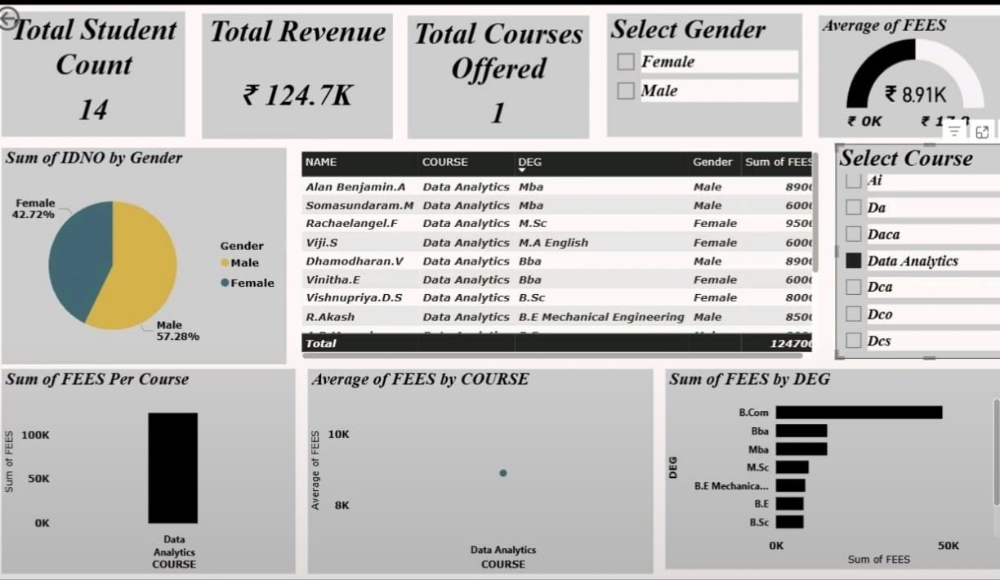
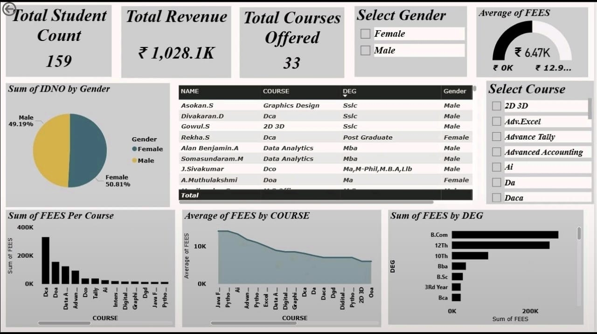

# TCDS Sales Report 2025

## Project Overview

This project presents a sales analysis and business intelligence dashboard developed during my work at **TCDS Computer Education, Selaiyur**.

The dashboard analyzes student and course-related data from **2025** to understand sales performance, course-wise enrollment and fee patterns, and other key business metrics. The analysis was designed to support data-driven decisions and help identify opportunities to improve and promote sales in **2026**.

## Business Objective

The main objective of this project was to transform student and course data into meaningful business insights that could support:

- Analysis of 2025 sales performance
- Understanding student enrollment patterns
- Comparison of courses based on student enrollment and fees
- Analysis of average fees collected per course
- Identification of important sales trends
- Evaluation of course-wise business performance
- Data-driven planning and sales promotion for 2026

## Dashboard

The Power BI dashboard provides a visual representation of the analyzed data, allowing business performance and course-level trends to be reviewed more efficiently.

### Sales Dashboard

### Sales Analysis

## Tools & Technologies

- Microsoft Power BI
- Microsoft Excel
- Data Analysis
- Data Visualization
- Business Intelligence
- Python for data analysis

## My Role

I worked with student and course-related data at TCDS Computer Education and developed the Power BI dashboard to analyze the organization's 2025 sales performance.

My work included:

- Preparing and analyzing the available data
- Organizing student and course information
- Analyzing course-wise fees and enrollment
- Calculating and comparing average fees per course
- Creating meaningful visualizations
- Developing the Power BI dashboard
- Presenting business insights to support future sales planning

## Key Skills Demonstrated

- Data Cleaning & Preparation
- Exploratory Data Analysis
- Business Intelligence
- Data Visualization
- Dashboard Development
- Power BI
- Excel
- Python
- Business Reporting
- Insight Generation

## Power BI Report

The original Power BI report file is included in this repository:
[Download the Power BI Report](./TCDS%20DETAILS%20REPORT.pbix)

> **Note:** The `.pbix` file can be downloaded and opened using Microsoft Power BI Desktop.

## Project Outcome

The dashboard converts raw student and course data into a structured visual report that can be used to understand 2025 performance and support data-driven sales and promotional planning for 2026.
